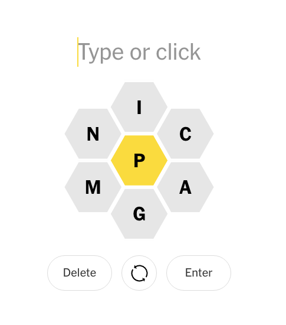

# spelling Bee
solve NYT spelling bee using regular expressions




## How to use the function

Use all 7 letters in the possible letters including the one in the center.
You can add `%>% view()` at the end of the function to view all possible
words. 

```
spellingBee(possible_letters = "GANIMCP", req_letter = "P")
```